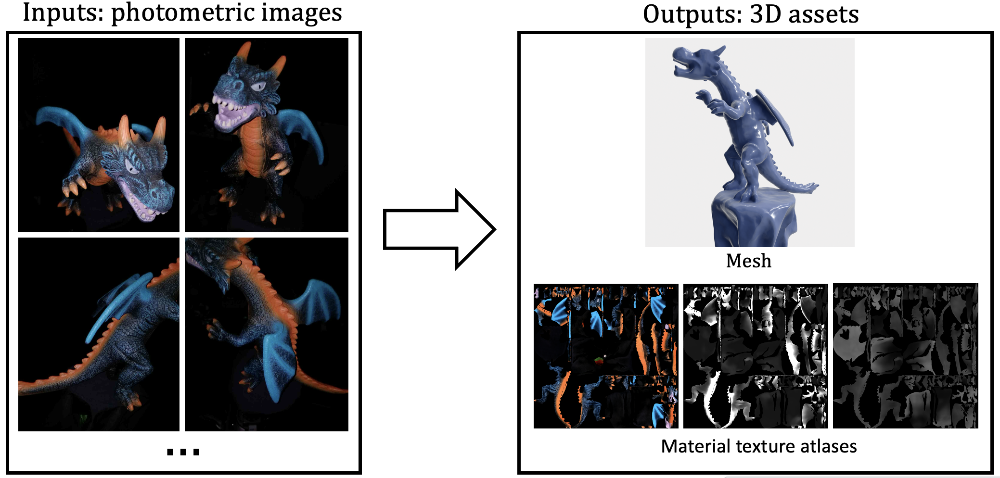
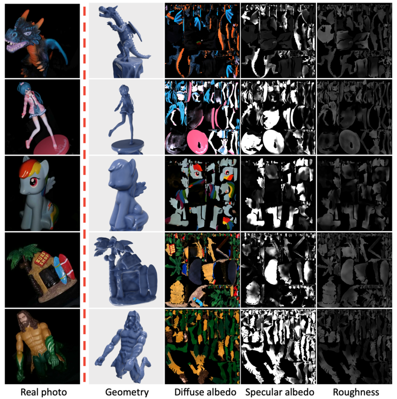

# IRON: Inverse Rendering by Optimizing Neural SDFs and Materials from Photometric Images

Note: this repo is still under construction.

Project page: <https://kai-46.github.io/IRON-website/>



## Usage

### Create environment

```shell
git clone https://github.com/Kai-46/iron.git && cd iron && . ./create_env.sh
```

### Download data

```shell
. ./download_data.sh
```

### Training and testing

```shell
. ./train_scene.sh drv/dragon
```

Once training is done, you will see the recovered mesh and materials under the folder ```./exp_iron_stage2/drv/dragon/mesh_and_materials_50000/```. At the same time, the rendered test images are under the folder ``````./exp_iron_stage2/drv/dragon/render_test_50000/``````

### Relight the 3D assets using envmaps

Check ```render_rgb_envmap_mat.py```.

## Citations

```
@inproceedings{iron-2022,
  title={IRON: Inverse Rendering by Optimizing Neural SDFs and Materials from Photometric Images},
  author={Zhang, Kai and Luan, Fujun and Li, Zhengqi and Snavely, Noah},
  booktitle={IEEE Conf. Comput. Vis. Pattern Recog.},
  year={2022}
}
```

## Example results

<https://user-images.githubusercontent.com/21653654/174612222-91302de2-34f2-429c-b53e-f78f140873c4.mp4>



## Acknowledgements

We would like to thank the authors of [IDR](https://github.com/lioryariv/idr) and [NeuS](https://github.com/Totoro97/NeuS) for open-sourcing their projects.
